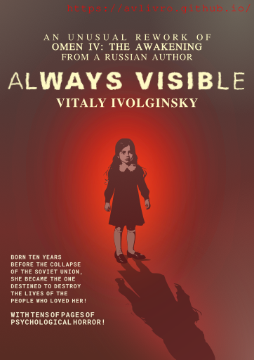

# Always Visible — avlivro

  

Tagline: **The waves of truth tends to extinguish fire of the falsehood**

## Description

Welcome to the repository for the **"Always Visible — avlivro"** website. This repository hosts the static version of the website for the literary work **"Always Visible (Another Prayer for the Dying Horror Genre)"** written by **Vitaly Ivolginsky**, inspired by the film **"Omen IV: The Awakening"** and dedicated to **Asia Vieira**.

## What is avlivro?

**"Always Visible"** offers a unique literary reinterpretation of themes and story elements from **"Omen IV: The Awakening"**. Unlike the film, where Delia is the daughter of the Antichrist, the work portrays her as an ordinary child from a biological family, unfolding in a distinct narrative environment.

## How to Use

You can explore the website by visiting the deployed site at [https://avlivro.github.io](https://avlivro.github.io). The static version of the site includes all pages, posts, and images related to the work.

## Multilingual Support

The website is available in both Russian and English. By default, the site is displayed in Russian, but you can easily switch to English by clicking the flag button located in the upper right corner of the page.

## License

The literary work **"Always Visible (Another Prayer for the Dying Horror Genre)"** is in the public domain. This repository, however, is licensed under the [Creative Commons Zero (CC0) 1.0 Universal (CC0 1.0) Public Domain Dedication](https://creativecommons.org/publicdomain/zero/1.0/). This means that you are free to use, copy, modify, and distribute the content in any way you like, without any restrictions.
